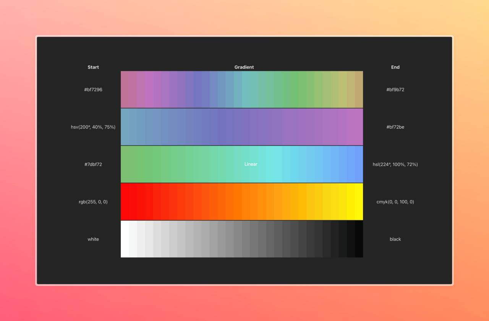

# 🌟 Huefy

Smooth color interpolation with customizable curves and support for mixing multiple color formats like HEX, RGB, RGBA, HSL, HSV, HWB, CMYK, and color keywords.

The purpose of this package is to take two colors, and find the color x percentage of the way inbetween them.

### Key Features:
- **Smooth Interpolation:** Seamlessly transition between colors using customizable curve functions.
- **Multiple Color Formats:** Output colors in HEX, RGB, RGBA, HSL, HSV, HWB, CMYK, and color keyword (red, green, blue...) format.
- **Easy to Use:** Simple API for both JavaScript and command-line usage.
- **Customizable:** Choose different interpolation curves for your color transitions.

## 🚀 Installation

```bash
npm install huefy
```

## 🛠 Getting Started

To get started with Huefy, import the function and start creating beautiful color transitions:

```javascript
import huefy from 'huefy';

const startColor = '#ff0000';
const endColor = '#0000ff';
const percentage = 0.5;

const resultColor = huefy(startColor, endColor, percentage, { as: 'rgb' });
console.log(resultColor); // Outputs: rgb(128, 0, 128)
```

## 📸 Example
How the interpolated colors look at various percentages between two colors:


## 🌟 Why Choose Huefy?

Huefy provides a simple yet powerful way to create smooth color interpolations with support for a wide range of color formats and customizable interpolation curves. This package could be used to create your own gradients, fade colors in and out, etc.

## 🌍 Supported Environments

- Node.js 14+
- ES Modules (import/export)
- CommonJS (require)

## 🎨 Customization

You can customize your color transitions by choosing different curve functions to control the interpolation between colors. The default curve is linear, but you can define your own curve function for more advanced effects.

```javascript
import huefy from 'huefy';

const customCurve = (value) => Math.pow(value, 2); // A simple quadratic curve

const resultColor = huefy('#ff0000', '#0000ff', 0.5, { curve: customCurve, as: 'hex' });
console.log(resultColor); // Outputs a color based on the custom curve
```

## 🔧 Command Line Usage

Huefy can also be used directly from the command line.

### Basic Usage

```bash
huefy <color1> <color2> <percentage> [options]
```

### Options

- **-f, --format [format]:** Specify the output format (cmyk, rgb, rgba, hex, hsl, hsv)

### Version

```bash
huefy --version
```

### Example Commands

Transition from red to blue at 50% and output the result in RGB format:

```bash
huefy '#ff0000' '#0000ff' 0.5 -f rgb
```

### Combining Options

You can combine different options to customize the output:

```bash
huefy '#ff0000' 'rgba(0, 129, 201, 0.25)' 0.25 -f rgba
```

## 🔧 Acknowledgments & Contributions

This package is built using great tools and libraries like `color-string` and `color-convert`. Contributions are welcome! Feel free to open issues or submit pull requests on GitHub.
